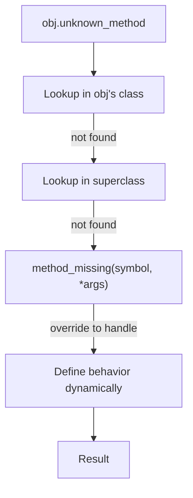

# Metaprogramming Basics 

## What Is Metaprogramming?

Metaprogramming is code that writes code. Ruby programs can modify themselves at runtime: define methods, intercept unknown method calls, and inspect their own structure.

You may rarely write metaprogramming code directly, but Rails uses it extensively. Understanding it helps you read Rails source code and debug unexpected behavior.

## send

Call any method by name, including private methods:

```ruby
class User
  def initialize(name)
    @name = name
  end

  private

  def secret
    "secret for #{@name}"
  end
end

user = User.new("Alice")
user.send(:secret)  # => "secret for Alice"
```

Rails uses `send` to call methods dynamically when the method name is determined at runtime (e.g., based on a URL parameter or database column).

Use `public_send` when you want to respect method visibility:

```ruby
user.public_send(:secret)  # NoMethodError: private method
```

## define_method

Define methods at runtime:

```ruby
class Metric
  [:views, :clicks, :conversions].each do |metric|
    define_method("total_#{metric}") do
      fetch_from_api(metric)
    end
  end

  private

  def fetch_from_api(metric)
    # API call
    rand(100..1000)
  end
end

m = Metric.new
m.total_views       # => 542
m.total_clicks      # => 287
m.total_conversions # => 31
```

Instead of writing three identical methods, one loop generates them all.

Rails does this in Active Record. When you define a model with a `users` table, Rails reads the table schema and generates getter/setter methods for each column at runtime:

```ruby
class User < ApplicationRecord
  # Rails automatically defines: id, name, email, created_at, updated_at
  # based on the database schema
end

User.new(name: "Alice")  # `name=` method exists because Rails generated it
```

## method_missing

Intercept calls to methods that do not exist:



```ruby
class DynamicFinder
  def initialize(data)
    @data = data
  end

  def method_missing(name, *args)
    if name.to_s.start_with?("find_by_")
      field = name.to_s.delete_prefix("find_by_")
      value = args.first
      @data.find { |record| record[field] == value }
    else
      super
    end
  end

  def respond_to_missing?(name, include_private = false)
    name.to_s.start_with?("find_by_") || super
  end
end

users = [
  { "name" => "Alice", "role" => "admin" },
  { "name" => "Bob", "role" => "viewer" },
]

finder = DynamicFinder.new(users)
finder.find_by_name("Alice")  # => {"name"=>"Alice", "role"=>"admin"}
finder.find_by_role("viewer") # => {"name"=>"Bob", "role"=>"viewer"}
```

Always override `respond_to_missing?` when you override `method_missing`. Without it, `respond_to?` returns `false` for methods handled by `method_missing`.

### Historical Context: Rails Dynamic Finders

Earlier versions of Rails used `method_missing` for methods like `User.find_by_email("alice@example.com")`. Modern Rails uses `find_by(email: "alice@example.com")` instead. The dynamic finders were removed in Rails 4. The pattern is still worth understanding because it appears in many Ruby libraries.

## class_eval and instance_eval

Execute a block in the context of a class or object:

```ruby
class User; end

User.class_eval do
  def greet
    "Hello"
  end
end

User.new.greet  # => "Hello"
```

Rails uses `class_eval` in concerns and engines to inject methods into existing classes.

## When to Use Metaprogramming

Use it when:

- You need to reduce repetitive method definitions that follow a pattern
- You are building a framework or DSL (like Rails does)
- You need to wrap or extend existing classes without modifying source

Do not use it when:

- A simple method definition would work
- It makes the code harder for the next developer to understand
- You are trying to be clever instead of clear

## The Rule of Least Surprise

Metaprogramming breaks the "principle of least surprise" because methods appear that are not visible in the source code. Use it sparingly, document it clearly, and always implement `respond_to_missing?`.

Move to `03-rails-fundamentals/01-rails-philosophy.md` to start learning Rails itself.
