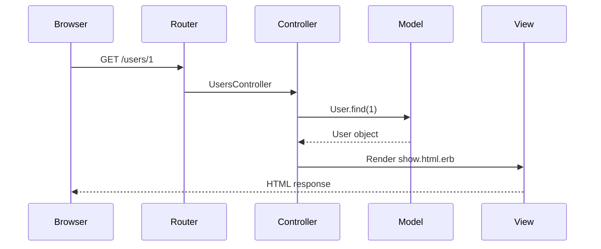
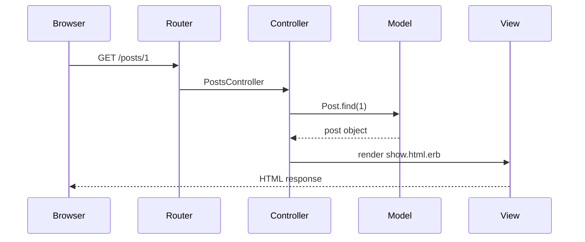

# MVC in Rails 

## What Is MVC?

Model-View-Controller is an architectural pattern that separates an application into three components:

- **Model** -- Data and business logic (Active Record)
- **View** -- Presentation layer (ERB templates, JSON responses)
- **Controller** -- Coordinates between model and view (Action Controller)

## Request Lifecycle

When a user visits `https://example.com/posts/1`, here is what happens:





Step by step:

1. **Browser** sends an HTTP request: `GET /posts/1`
2. **Router** matches the URL pattern and maps it to `PostsController#show` with `id: 1`
3. **Controller** calls `Post.find(1)` on the model
4. **Model** queries the database: `SELECT * FROM posts WHERE id = 1`
5. **Model** returns a `Post` object to the controller
6. **Controller** passes the `@post` instance variable to the view
7. **View** renders `show.html.erb`, interpolating `@post` data into HTML
8. **Response** is sent back to the browser

## The Model Layer (Active Record)

Models represent domain objects and talk to the database.

```ruby
# app/models/post.rb
class Post < ApplicationRecord
  has_many :comments, dependent: :destroy
  validates :title, presence: true, length: { maximum: 200 }
  validates :body, presence: true

  scope :published, -> { where(published: true) }
end
```

Responsibilities:

- Data access (queries, CRUD)
- Associations (relationships between tables)
- Validations (data integrity)
- Business logic (scopes, custom methods)

## The Controller Layer (Action Controller)

Controllers receive requests, coordinate with models, and render responses.

```ruby
# app/controllers/posts_controller.rb
class PostsController < ApplicationController
  before_action :set_post, only: [:show, :edit, :update, :destroy]

  def index
    @posts = Post.published.order(created_at: :desc)
  end

  def show
  end

  def create
    @post = Post.new(post_params)
    if @post.save
      redirect_to @post, notice: "Post created"
    else
      render :new, status: :unprocessable_content
    end
  end

  private

  def set_post
    @post = Post.find(params[:id])
  end

  def post_params
    params.require(:post).permit(:title, :body)
  end
end
```

Responsibilities:

- Parse incoming parameters
- Call model methods
- Decide what to render or redirect to
- Handle authorization and error cases

Controllers should be thin. If logic grows, extract it to service objects or model methods.

## The View Layer (Action View / ERB)

Views generate the response (HTML, JSON, XML).

```erb
<!-- app/views/posts/show.html.erb -->
<h1><%= @post.title %></h1>
<p><%= @post.body %></p>
<p>Published: <%= @post.created_at.strftime("%B %d, %Y") %></p>

<h2>Comments</h2>
<% @post.comments.each do |comment| %>
  <div>
    <p><%= comment.body %></p>
  </div>
<% end %>
```

`<%= %>` outputs the expression. `<% %>` executes Ruby without output.

Responsibilities:

- Display data from the controller
- Handle simple formatting (dates, currency)
- Iterate over collections for display

Views should contain no business logic. If you need a calculation, put it in the model or a helper.

## Where Business Logic Goes

| Logic | Where |
|-------|-------|
| Data access and validation | Model |
| Request coordination | Controller |
| Display formatting | View / Helper |
| Complex business operations | Service object |
| Shared controller behavior | Concern (module) |

Move to `03-routing-and-controllers.md` for routing details.
