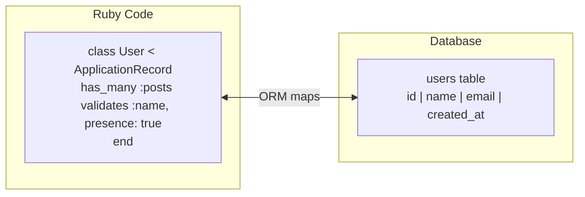

# Active Record 

## What Is Active Record?

Active Record is Rails' ORM (Object-Relational Mapper). It maps Ruby classes to database tables and Ruby objects to database rows.



Convention: a model named `Post` maps to a `posts` table. The table has an `id` primary key, `created_at`, and `updated_at` timestamps.

## Migrations

Migrations change the database schema over time. Each migration is a versioned file.

Create a migration:

```bash
bin/rails generate migration CreatePosts title:string body:text published:boolean
```

The generated migration:

```ruby
# db/migrate/20260608000000_create_posts.rb
class CreatePosts < ActiveRecord::Migration[8.0]
  def change
    create_table :posts do |t|
      t.string :title, null: false
      t.text :body
      t.boolean :published, default: false

      t.timestamps
    end
  end
end
```

Run migrations:

```bash
bin/rails db:migrate
```

Rollback the last migration:

```bash
bin/rails db:rollback
```

### Adding Columns

```ruby
class AddAuthorToPosts < ActiveRecord::Migration[8.0]
  def change
    add_column :posts, :author_name, :string
    add_index :posts, :author_name
  end
end
```

## CRUD Operations

```ruby
# Create
post = Post.create(title: "Hello", body: "World", published: true)

# Read
Post.all
Post.first
Post.find(1)
Post.find_by(title: "Hello")
Post.where(published: true)

# Update
post.update(title: "Updated Title")
post.update!(title: "Updated Title")  # raises on validation failure

# Delete
post.destroy
Post.destroy_all
```

## Associations

Associations define relationships between models.

### belongs_to / has_many

```ruby
# app/models/post.rb
class Post < ApplicationRecord
  has_many :comments, dependent: :destroy
  belongs_to :user
end

# app/models/comment.rb
class Comment < ApplicationRecord
  belongs_to :post
  belongs_to :user
end

# app/models/user.rb
class User < ApplicationRecord
  has_many :posts, dependent: :destroy
  has_many :comments, dependent: :destroy
end
```

Usage:

```ruby
user = User.first
user.posts           # all posts by this user
user.comments        # all comments by this user

post = Post.first
post.user            # the author
post.comments        # all comments on this post

comment = Comment.first
comment.post         # the parent post
comment.user         # the comment author
```

### has_many :through

For many-to-many relationships:

```ruby
class Author < ApplicationRecord
  has_many :book_authors
  has_many :books, through: :book_authors
end

class Book < ApplicationRecord
  has_many :book_authors
  has_many :authors, through: :book_authors
end

class BookAuthor < ApplicationRecord
  belongs_to :book
  belongs_to :author
end
```

## Validations

Validations ensure data integrity before saving to the database.

```ruby
class Post < ApplicationRecord
  validates :title, presence: true, length: { maximum: 200 }
  validates :body, presence: true
  validates :published, inclusion: { in: [true, false] }

  validate :body_has_minimum_words

  private

  def body_has_minimum_words
    return if body.nil?
    if body.split.size < 10
      errors.add(:body, "must be at least 10 words")
    end
  end
end
```

```ruby
post = Post.new(title: "Short", body: "Hi")
post.valid?     # => false
post.errors.full_messages
# => ["Body must be at least 10 words"]
```

## Scopes

Named queries you can chain:

```ruby
class Post < ApplicationRecord
  scope :published, -> { where(published: true) }
  scope :recent, -> { order(created_at: :desc).limit(10) }
  scope :by_user, ->(user) { where(user: user) }
end

Post.published.recent
User.first.posts.published.by_user(current_user)
```

## Query Patterns

```ruby
# Where with conditions
Post.where("created_at > ?", 1.week.ago)
Post.where(title: ["Hello", "World"])  # IN clause

# Joins
Post.joins(:comments).where(comments: { user_id: 1 })

# Pluck (returns array of values, not objects)
Post.published.pluck(:title)
# => ["First Post", "Second Post"]

# Count / exists?
Post.count
Post.where(published: true).exists?
```

## Blog Example: Complete Models

```ruby
class User < ApplicationRecord
  has_many :posts, dependent: :destroy
  has_many :comments, dependent: :destroy

  validates :email, presence: true, uniqueness: true
  validates :name, presence: true
end

class Post < ApplicationRecord
  belongs_to :user
  has_many :comments, dependent: :destroy

  validates :title, presence: true, length: { maximum: 200 }
  validates :body, presence: true

  scope :published, -> { where(published: true) }
  scope :recent, -> { order(created_at: :desc) }
end

class Comment < ApplicationRecord
  belongs_to :post
  belongs_to :user

  validates :body, presence: true
end
```

Move to `05-views-and-hotwire.md` for the view layer and modern Rails frontend.
