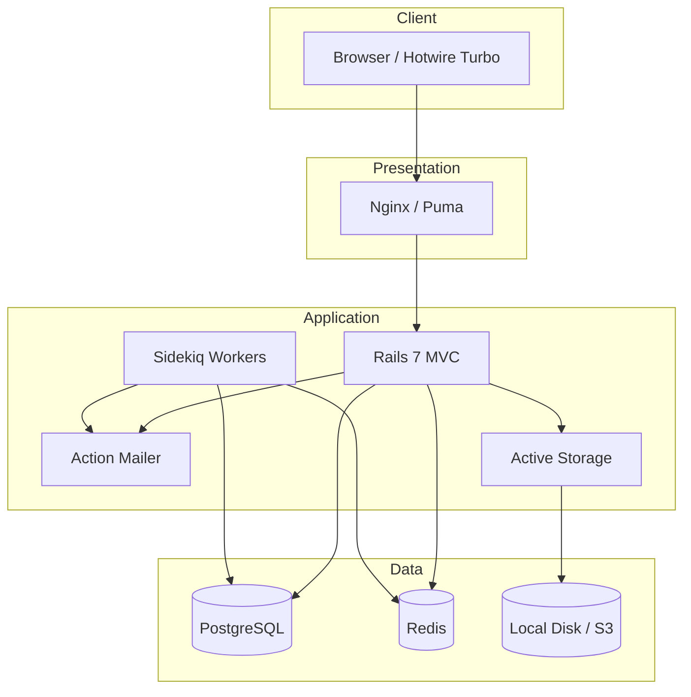

# Capstone Project: Automated Recruitment Pipeline

## Business Context

Recruitment teams manually sift through hundreds of applications per role, leading to slow hiring, missed talent, and inconsistent screening. This project builds an automated recruitment pipeline that manages job postings, screens candidates via keyword matching, schedules interviews, and tracks every applicant through a defined hiring funnel.

**Challenge Repo:** https://github.com/TP-Coder-Innovation-Hub/automated-recruitment-pipeline-challenge

---

## Learning Objectives

1. Build a production-grade Rails 7 monolith following MVC and Active Record conventions.
2. Implement background job processing with Sidekiq (resume screening, email delivery).
3. Deliver real-time UI updates using Hotwire/Turbo Streams without a separate JS framework.
4. Model a multi-state domain workflow with state machines and auditable transitions.
5. Write system tests with Capybara covering critical user paths end-to-end.

---

## Architecture

3-tier Rails monolith: Nginx/Puma (presentation), Rails MVC (application), PostgreSQL (data). Sidekiq + Redis for async processing. Active Storage with local disk (production: S3).

---

## Features & Acceptance Criteria

### 1. Job Posting Management

**Description:** Recruiters create, edit, publish, and close job postings.

**Acceptance Criteria:**
- Given a recruiter is authenticated, when they create a job posting with title, description, department, location, and required skills, then the posting is saved in `draft` status.
- Given a draft posting, when the recruiter publishes it, then it becomes visible to candidates and the `published_at` timestamp is set.
- Given a published posting, when the recruiter closes it, then it no longer accepts new applications.
- Validation: title and description are required; title is unique per department.

**Key Models:** `JobPosting` (status: draft/published/closed)

---

### 2. Candidate Application

**Description:** Candidates submit applications with resume upload and track their status.

**Acceptance Criteria:**
- Given a published job posting, when a candidate submits name, email, cover letter, and resume (PDF/DOCX, max 5MB), then an `Application` record is created in `applied` status.
- Given the candidate's email, when they visit the application tracker, then they see their current status and timestamp history.
- Duplicate applications (same email + job) are rejected with a validation error.
- Resume is stored via Active Storage and virus-scanned in a background job (mock implementation).

**Key Models:** `Application` (status: applied/screening/shortlisted/interview/offer/hired/rejected), `Candidate`

---

### 3. Screening Workflow

**Description:** Automated resume keyword matching, scoring, and shortlisting.

**Acceptance Criteria:**
- Given a new application, when the resume is uploaded, then a Sidekiq job extracts text and scores it against the job's required skills.
- Scoring: each matched keyword from the job's skill list adds points. Score = (matched / total) * 100.
- Given an application with score >= 70, when screening completes, then status moves to `shortlisted`.
- Given an application with score < 70, when screening completes, then status moves to `rejected` and a rejection email is queued.
- Recruiter can override the automated decision (shortlist or reject manually).

**Key Models:** `ScreeningResult` (score, matched_keywords, raw_text_extract)

---

### 4. Interview Scheduling

**Description:** Schedule interviews with calendar integration (mock) and email invitations.

**Acceptance Criteria:**
- Given a shortlisted candidate, when the recruiter creates an interview (date, time, interviewer name, type: phone/video/onsite), then an `Interview` record is created and the application status moves to `interview`.
- When the interview is created, then an invitation email is sent to the candidate via Action Mailer + Sidekiq.
- Given a scheduled interview, when the date passes without feedback, then the system flags it as `no_show` in a daily Sidekiq cron job.
- Recruiter records interview feedback (rating 1-5, notes). Rating >= 4 enables the recruiter to advance to offer.

**Key Models:** `Interview` (scheduled_at, interviewer, kind, feedback, rating)

---

### 5. Hiring Status Tracking

**Description:** Pipeline view showing candidates across all stages with real-time updates.

**Acceptance Criteria:**
- Given a job posting, when the recruiter opens the pipeline view, then they see a Kanban-style board with columns: Applied, Screening, Shortlisted, Interview, Offer, Hired, Rejected.
- Each column shows candidate cards with name, score, and days-in-stage.
- When a candidate's status changes (via any action), then the card animates to the new column via Turbo Streams without a full page reload.
- The pipeline view supports filtering by date range and sorting by score or application date.

**Key Implementation:** Turbo Stream broadcasts from `Application` model callbacks.

---

### 6. Reporting

**Description:** Metrics dashboards for hiring efficiency.

**Acceptance Criteria:**
- **Time-to-Hire:** Average days from `applied` to `hired` per job posting and overall.
- **Funnel Conversion Rates:** Percentage of candidates advancing at each stage (applied -> screening -> interview -> offer -> hired).
- **Source Effectiveness:** Track application source (referral, job board, direct) and compare conversion rates per source.
- Reports are rendered as HTML tables with simple CSS bar charts. No charting library required.
- Recruiter can export any report as CSV.

**Key Models:** `ApplicationEvent` (timestamped audit log for stage transitions), `Application#source`

---

## Tech Constraints

| Constraint | Requirement |
|---|---|
| Rails version | 7+ (Rails 7.1 or later) |
| Ruby version | 3.2+ |
| Database | PostgreSQL 15+ |
| Background Jobs | Sidekiq with Redis |
| Frontend | Rails server-rendered views + Hotwire/Turbo (no React/Vue/Angular) |
| File Storage | Active Storage (local disk for dev, S3 for production) |
| Containerization | Docker Compose for local development (app, PostgreSQL, Redis, Sidekiq) |
| Testing | Minitest or RSpec + Capybara system tests |
| Deployment | Render.com or Fly.io |
| State Machine | Use AASM gem or hand-rolled state machine with transition validation |
| Authentication | Devise or Rails 7.1 built-in `has_secure_password` approach |
| Authorization | Pundit or Cancancan for role-based access (recruiter vs admin) |

---

## Architecture Decision Records

### ADR-001: Monolith over Microservices

**Context:** The recruitment pipeline is a single bounded context with tight coupling between jobs, applications, screening, and interviews.

**Decision:** Build a Rails monolith. No service decomposition.

**Consequences:** Simpler deployment, easier transactional boundaries, one codebase to maintain. Acceptable for the expected scale (hundreds of applications per day, not millions).

---

### ADR-002: Sidekiq for Background Processing

**Context:** Resume screening and email sending are slow operations that block request cycles.

**Decision:** Use Sidekiq with Redis as the job backend.

**Consequences:** Reliable retry logic, scheduled jobs for daily no-show checks, job monitoring via Sidekiq Web UI. Requires Redis as an additional infrastructure dependency.

---

### ADR-003: Hotwire/Turbo Instead of SPA Framework

**Context:** The pipeline view needs real-time updates when candidates move between stages.

**Decision:** Use Hotwire/Turbo Streams to broadcast model changes to connected clients.

**Consequences:** No JavaScript framework or API layer needed. Server-rendered HTML partials replace DOM elements. Tighter coupling between server and client (acceptable for a monolith). Limited offline capability.

---

### ADR-004: Active Storage for Resume Uploads

**Context:** Candidates upload PDF/DOCX resumes that must be stored and processed.

**Decision:** Use Active Storage with local disk in development and S3 in production.

**Consequences:** Built-in file validation, variant support, and direct upload capability. Resume text extraction is done in a Sidekiq job after upload, not inline.

---

### ADR-005: AASM State Machine for Application Workflow

**Context:** Applications transition through seven states with strict rules about valid transitions.

**Decision:** Use the AASM gem to define states and transitions on the `Application` model.

**Consequences:** Declarative state definitions, guard conditions, callback hooks on transitions, and audit logging via `ApplicationEvent`. Adds a gem dependency but prevents invalid state transitions at the model layer.

---

## Submission Checklist

- [ ] Repository forked from challenge repo and all code pushed to `main`
- [ ] `README.md` with setup instructions (Docker Compose `bin/setup` flow)
- [ ] Docker Compose runs the full stack with a single `docker compose up`
- [ ] Database seeded with sample data (`db/seeds.rb`): at least 3 job postings, 20 applications across stages
- [ ] All features implemented with acceptance criteria met
- [ ] System tests (Capybara) covering: job CRUD, application submission, pipeline view, screening flow
- [ ] Test suite passes in CI (`bundle exec rake` or equivalent)
- [ ] Sidekiq Web UI mounted at `/sidekiq` in development
- [ ] Action Mailer previews available for all email templates
- [ ] Code follows Rails conventions (routing, naming, concerns where DRY is needed)
- [ ] No `binding.irb` or debug breakpoints in committed code
- [ ] Application deployed to Render.com or Fly.io with production URL in README
- [ ] Linting passes (`rubocop` with standard Rails config, zero offenses)
