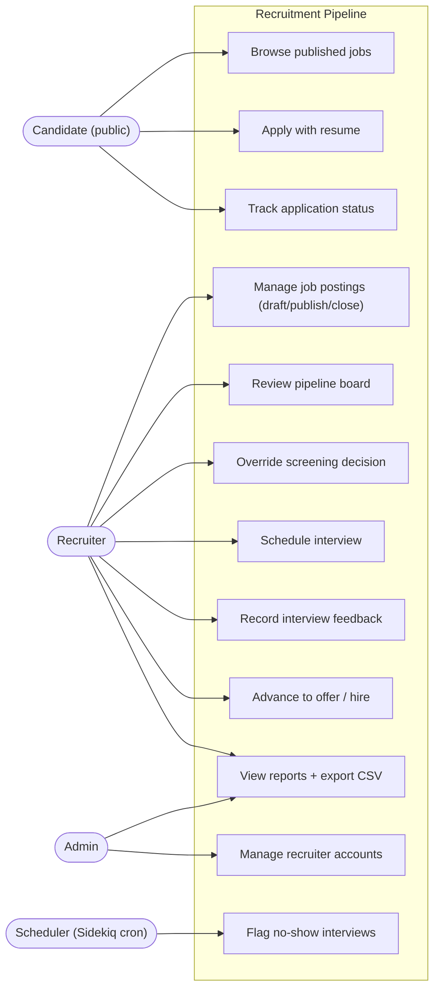
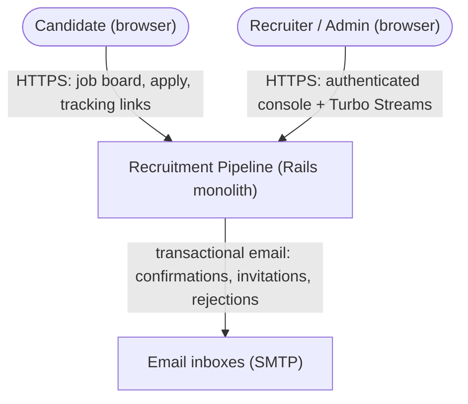
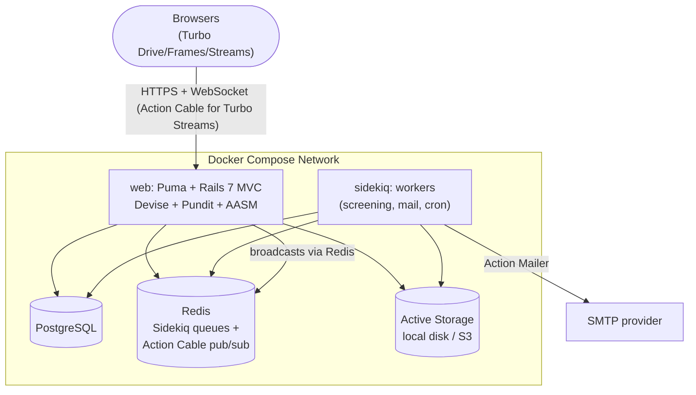
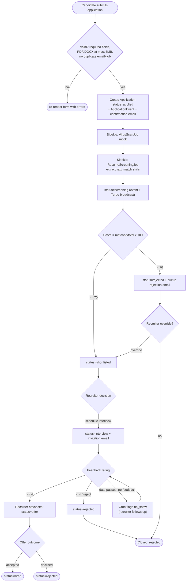
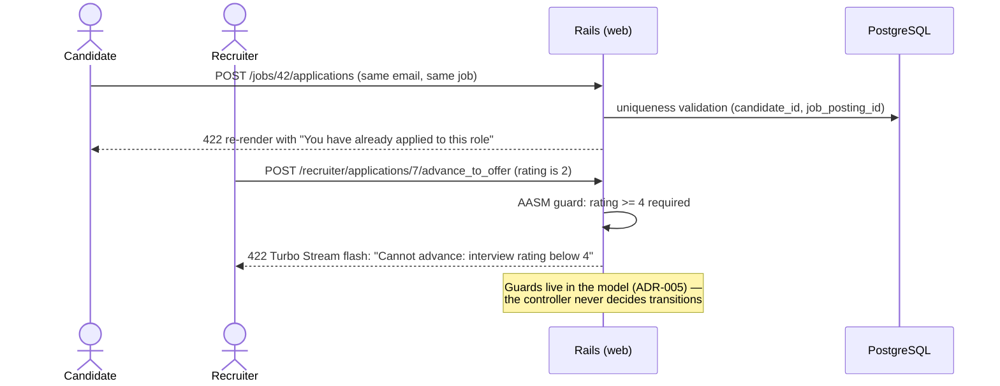
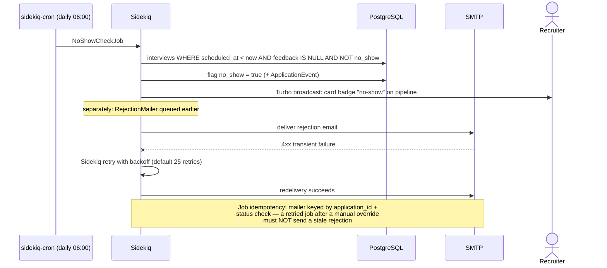

# Workshop Design: Automated Recruitment Pipeline

> Companion to [01-workshop-spec.md](./01-workshop-spec.md). This is a **server-rendered Rails monolith** (Hotwire/Turbo — ADR-003): there is no SPA and no JSON API. The contracts here are Rails routes, page designs, Sidekiq job contracts, and Turbo Stream broadcasts. Code organization follows Rails conventions — that part is *not* yours to reinvent.

## Design Notes (read first)

1. **Candidates have no accounts.** Recruiters/admins authenticate (Devise); candidates apply via a public form. Status tracking works through a **signed tracking URL** (`Rails.application.message_verifier` or `signed_id`) emailed on application. A `/track` form accepts an email and *re-sends the links* rather than displaying results inline — entering someone's email must never reveal their applications (enumeration safety). This satisfies the spec's "visit the application tracker by email" without building candidate auth.
2. **Rejected is a column, not always an end-state.** The state machine allows `rejected` from `screening` (auto), and from any later stage (manual), and allows the recruiter override `rejected → shortlisted` (spec: "recruiter can override the automated decision"). Every transition writes an `ApplicationEvent` — the events table is also what the reports aggregate, so get it right first.
3. **Screening score lives on `ScreeningResult`, surfaced on the card.** Don't duplicate the score onto `applications`; the pipeline card joins through. One source of truth.
4. **Mocks are explicit objects.** Virus scan and calendar invite are mock implementations behind small classes (`VirusScanner`, `CalendarClient`) so tests can assert against them and a future real integration swaps in cleanly.

---

## Part 1: High-Level Design

### 1.1 Use-Case Diagram



### 1.2 System Context Diagram



### 1.3 Container Diagram



One codebase, two processes (`web`, `sidekiq`). Turbo Stream broadcasts flow web/worker → Redis → Action Cable → subscribed browsers.

### 1.4 Activity Diagram — Application Lifecycle (primary business process)



### 1.5 Sequence Diagrams

#### 1.5.1 Happy path — apply, screen, card moves live

```mermaid
sequenceDiagram
    actor C as Candidate
    participant W as Rails (web)
    participant PG as PostgreSQL
    participant SK as Sidekiq
    actor R as Recruiter (pipeline open)

    C->>W: POST /jobs/42/applications (multipart, resume)
    W->>PG: INSERT candidate (find_or_create), application 'applied', event
    W->>SK: enqueue VirusScanJob → ResumeScreeningJob
    W-->>C: redirect: confirmation + tracking link emailed
    SK->>SK: extract text, match skills (8/10 → score 80)
    SK->>PG: INSERT screening_result; AASM applied→screening→shortlisted (+events)
    SK->>R: Turbo Stream broadcast (via Redis/Action Cable):<br/>remove card from Applied, append to Shortlisted
    Note over R: Kanban card moves without reload (ADR-003)
```

#### 1.5.2 Error path — duplicate application and invalid transition



#### 1.5.3 Async path — daily no-show cron + rejection email retry



---

## Part 2: Frontend Design (server-rendered + Hotwire)

### 2.1 Frontend Justification

Rails server-rendered views with Hotwire — per the frontend assignment and ADR-003. No Vue, no Android: the real-time pipeline board is Turbo Streams' showcase use case, and building it without a SPA *is* the lesson. Two view areas: a public candidate site and an authenticated `/recruiter` console.

### 2.2 Page Map

**Public**

| Path | Page | Purpose |
|---|---|---|
| `/` | Job board | Published postings, filter by department/location |
| `/jobs/:id` | Job detail | Description, skills; "Apply" CTA (hidden when closed) |
| `/jobs/:id/applications/new` | Application form | Name, email, cover letter, resume upload (direct upload) |
| `/track` | Tracker request | Email form → sends tracking links (Design Note 1) |
| `/applications/:signed_token` | Status tracker | Current status + `ApplicationEvent` timeline, read-only |

**Recruiter console (`/recruiter`, Devise + Pundit)**

| Path | Page | Purpose |
|---|---|---|
| `/recruiter/job_postings` | Postings index | Status badges, draft/publish/close actions |
| `/recruiter/job_postings/new`, `/:id/edit` | Posting form | Fields incl. skills list (tag input) |
| `/recruiter/job_postings/:id/pipeline` | **Pipeline board** | Kanban: Applied / Screening / Shortlisted / Interview / Offer / Hired / Rejected; live Turbo Stream updates; filter by date range, sort by score/date |
| `/recruiter/applications/:id` | Application detail | Resume preview, screening result (score, matched keywords), event timeline, action buttons (shortlist/reject override, schedule interview, advance, hire) |
| `/recruiter/applications/:id/interviews/new` | Interview form | Date/time, interviewer, kind (phone/video/onsite) |
| `/recruiter/interviews/:id/edit` | Feedback form | Rating 1–5 + notes |
| `/recruiter/reports` | Reports hub | Time-to-hire, funnel conversion, source effectiveness — HTML tables + CSS bars, CSV export links |
| `/admin/users` | User management | Admin only (Pundit): invite recruiters, toggle roles |

### 2.3 Key UI Interactions (Turbo specifics)

| Interaction | Mechanism |
|---|---|
| Live pipeline board | Each column is a `turbo_stream_from [job_posting, :pipeline]` target; `Application` after-transition callback broadcasts `remove` (old column) + `prepend` (new column) of the card partial. Card shows name, score, days-in-stage (computed from last event) |
| Status actions | Buttons are `button_to` with Turbo; responses are Turbo Streams updating the detail page *and* the broadcast updates any open boards — same partial, no duplication |
| Resume upload | Active Storage direct upload with client-side size/type hints; server validation is authoritative (5 MB, PDF/DOCX) |
| Form errors | 422 + Turbo-rendered inline errors (Rails 7 default) — no JS validation library |
| Filters on the board | `GET` form inside a Turbo Frame wrapping the board — filtering re-renders the frame, broadcasts still apply (note: filtered-out cards may appear via broadcast; acceptable, document it) |
| Report CSV | Plain `format.csv` responses — `/recruiter/reports/funnel.csv?from=&to=` |
| Sidekiq Web UI | Mounted at `/sidekiq` (dev), behind admin auth in production |

---

## Part 3: Route Contracts (in place of REST API)

Rails routes with conventional verbs; all `/recruiter` and `/admin` routes require authentication, Pundit-scoped (recruiter role for recruiter routes, admin for admin routes). Responses are HTML / Turbo Stream / CSV — never JSON.

| Verb + Path | Params | Success | Failure |
|---|---|---|---|
| `GET /` | `department`, `location` | 200 job board | — |
| `GET /jobs/:id` | — | 200 (published only) | 404 (draft/closed hidden) |
| `POST /jobs/:id/applications` | `application[name, email, cover_letter, resume, source]` | 302 → confirmation | 422 (validation, duplicate, file too big/wrong type); 404 when posting closed |
| `POST /track` | `email` | 302 "links sent if account exists" (always — no enumeration) | 422 invalid email format |
| `GET /applications/:signed_token` | — | 200 timeline | 404 invalid/expired token |
| `POST /recruiter/job_postings` | `job_posting[title, description, department, location, skills[]]` | 302 → posting | 422 (title required, unique per department) |
| `PATCH /recruiter/job_postings/:id/publish` | — | Turbo Stream status badge | 422 INVALID_TRANSITION (e.g., closed posting) |
| `PATCH /recruiter/job_postings/:id/close` | — | Turbo Stream | 422 |
| `GET /recruiter/job_postings/:id/pipeline` | `from`, `to`, `sort=score\|applied_at` | 200 board | — |
| `PATCH /recruiter/applications/:id/shortlist` | — | Turbo Stream card move | 422 guard violation |
| `PATCH /recruiter/applications/:id/reject` | `reason` | Turbo Stream + queues rejection email | 422 |
| `PATCH /recruiter/applications/:id/advance_to_offer` | — | Turbo Stream | 422 (guard: latest rating >= 4) |
| `PATCH /recruiter/applications/:id/hire` | — | Turbo Stream | 422 (only from offer) |
| `POST /recruiter/applications/:id/interviews` | `interview[scheduled_at, interviewer, kind]` | 302; status → interview; invitation email queued | 422 (past datetime, kind not in enum) |
| `PATCH /recruiter/interviews/:id` | `interview[rating, feedback]` | 302 → application | 422 (rating 1–5) |
| `GET /recruiter/reports/time_to_hire(.csv)` | `from`, `to` | 200 | — |
| `GET /recruiter/reports/funnel(.csv)` | `job_posting_id?`, `from`, `to` | 200 | — |
| `GET /recruiter/reports/sources(.csv)` | `from`, `to` | 200 | — |
| Devise routes (`/recruiters/sign_in` etc.) | — | standard | standard |

State machine (AASM on `Application`) — the transition table behind the PATCH routes:

| Event | From → To | Guard |
|---|---|---|
| `start_screening` | applied → screening | (job-internal) |
| `shortlist` | screening, rejected → shortlisted | manual override allowed (Design Note 2) |
| `reject` | screening, shortlisted, interview, offer → rejected | — |
| `schedule_interview` | shortlisted → interview | interview record created |
| `advance_to_offer` | interview → offer | latest interview rating >= 4 |
| `hire` | offer → hired | — |

---

## Part 4: Database Schema

Rails-conventional DDL (what the migrations should produce). Active Storage tables (`active_storage_blobs/attachments/variant_records`) come from `rails active_storage:install` — not repeated here.

```sql
CREATE TABLE users (                       -- Devise: recruiters + admins
    id                 BIGSERIAL PRIMARY KEY,
    email              VARCHAR NOT NULL UNIQUE,
    encrypted_password VARCHAR NOT NULL,
    name               VARCHAR NOT NULL,
    role               VARCHAR NOT NULL DEFAULT 'recruiter' CHECK (role IN ('recruiter','admin')),
    created_at TIMESTAMPTZ NOT NULL, updated_at TIMESTAMPTZ NOT NULL
);

CREATE TABLE job_postings (
    id           BIGSERIAL PRIMARY KEY,
    title        VARCHAR NOT NULL,
    description  TEXT    NOT NULL,
    department   VARCHAR NOT NULL,
    location     VARCHAR NOT NULL,
    skills       VARCHAR[] NOT NULL DEFAULT '{}',   -- keyword list for screening
    status       VARCHAR NOT NULL DEFAULT 'draft' CHECK (status IN ('draft','published','closed')),
    published_at TIMESTAMPTZ,
    user_id      BIGINT NOT NULL REFERENCES users(id),
    created_at TIMESTAMPTZ NOT NULL, updated_at TIMESTAMPTZ NOT NULL
);
CREATE UNIQUE INDEX idx_postings_title_dept ON job_postings (lower(title), department);  -- unique per department
CREATE INDEX idx_postings_status ON job_postings (status);

CREATE TABLE candidates (
    id    BIGSERIAL PRIMARY KEY,
    name  VARCHAR NOT NULL,
    email VARCHAR NOT NULL UNIQUE,
    created_at TIMESTAMPTZ NOT NULL, updated_at TIMESTAMPTZ NOT NULL
);

CREATE TABLE applications (
    id             BIGSERIAL PRIMARY KEY,
    job_posting_id BIGINT NOT NULL REFERENCES job_postings(id),
    candidate_id   BIGINT NOT NULL REFERENCES candidates(id),
    cover_letter   TEXT,
    source         VARCHAR NOT NULL DEFAULT 'direct' CHECK (source IN ('referral','job_board','direct')),
    status         VARCHAR NOT NULL DEFAULT 'applied'
                   CHECK (status IN ('applied','screening','shortlisted','interview','offer','hired','rejected')),
    created_at TIMESTAMPTZ NOT NULL, updated_at TIMESTAMPTZ NOT NULL,
    UNIQUE (job_posting_id, candidate_id)          -- duplicate-application rule, DB-enforced
);
CREATE INDEX idx_applications_pipeline ON applications (job_posting_id, status);

CREATE TABLE screening_results (
    id               BIGSERIAL PRIMARY KEY,
    application_id   BIGINT NOT NULL REFERENCES applications(id) UNIQUE,  -- one result per application
    score            INT    NOT NULL CHECK (score BETWEEN 0 AND 100),
    matched_keywords VARCHAR[] NOT NULL DEFAULT '{}',
    raw_text_extract TEXT,
    created_at TIMESTAMPTZ NOT NULL, updated_at TIMESTAMPTZ NOT NULL
);

CREATE TABLE interviews (
    id             BIGSERIAL PRIMARY KEY,
    application_id BIGINT NOT NULL REFERENCES applications(id),
    scheduled_at   TIMESTAMPTZ NOT NULL,
    interviewer    VARCHAR NOT NULL,
    kind           VARCHAR NOT NULL CHECK (kind IN ('phone','video','onsite')),
    rating         INT CHECK (rating BETWEEN 1 AND 5),
    feedback       TEXT,
    no_show        BOOLEAN NOT NULL DEFAULT false,
    created_at TIMESTAMPTZ NOT NULL, updated_at TIMESTAMPTZ NOT NULL
);
CREATE INDEX idx_interviews_noshow_scan ON interviews (scheduled_at) WHERE rating IS NULL AND NOT no_show;

CREATE TABLE application_events (          -- audit log + the reports' source of truth
    id             BIGSERIAL PRIMARY KEY,
    application_id BIGINT NOT NULL REFERENCES applications(id),
    from_status    VARCHAR,
    to_status      VARCHAR NOT NULL,
    actor_type     VARCHAR NOT NULL CHECK (actor_type IN ('system','recruiter','cron')),
    actor_id       BIGINT,                 -- users.id when recruiter
    metadata       JSONB,                  -- e.g. { "score": 80 } or { "override": true }
    created_at     TIMESTAMPTZ NOT NULL
);
CREATE INDEX idx_events_application ON application_events (application_id, created_at);
CREATE INDEX idx_events_reporting ON application_events (to_status, created_at);
```

Non-obvious decisions: the duplicate rule is a DB unique index *and* a model validation (the validation gives the friendly 422; the index wins races); `skills` as a Postgres array keeps screening simple without a join table — a deliberate monolith-scale choice; time-to-hire and funnel reports are pure `application_events` aggregations, which is why every transition (including system and cron ones) must write an event.

---

## Part 5: Async Contracts (Sidekiq jobs + Turbo broadcasts + email)

### Sidekiq job contracts

| Job | Queue | Args | Behavior contract |
|---|---|---|---|
| `VirusScanJob` | `default` | `application_id` | Mock scanner; on "infected" (filename contains `eicar` — testable) purge attachment, reject application with event metadata. Chains `ResumeScreeningJob` on clean |
| `ResumeScreeningJob` | `default` | `application_id` | Extract text (pdf-reader / docx gem) → `ScreeningResult` → AASM transition by score. **Idempotent:** skips if a `screening_result` already exists |
| `RejectionEmailJob` (or mailer `deliver_later`) | `mailers` | `application_id` | Sends only if status is still `rejected` at run time (guards the override race — see 1.5.3) |
| `InterviewInvitationJob` | `mailers` | `interview_id` | Invitation email + mock `CalendarClient.create_event` |
| `NoShowCheckJob` | `cron` (sidekiq-cron, daily 06:00) | — | Flags past interviews without feedback; writes events; broadcasts. Idempotent via the `NOT no_show` filter |

Retry: Sidekiq defaults (exponential, 25 attempts) for mailers; `ResumeScreeningJob` limited to 5 retries then dead set — a poison resume must not loop forever. Failed-job triage via Sidekiq Web UI.

### Turbo Stream broadcast contracts

| Stream | Subscribed by | Broadcast payloads |
|---|---|---|
| `[job_posting, :pipeline]` | pipeline board page | `remove` card `#application_{id}` + `prepend` rendered `_card` partial into `#column_{status}`; badge `replace` on no-show |
| `[application]` | application detail page | `replace` `#application_status` and `#event_timeline` partials |

Broadcasts originate from `Application` AASM `after_transition` callbacks (model layer), so web- and worker-initiated transitions broadcast identically.

### Email contracts (Action Mailer, previews required)

| Mailer | Trigger | Must contain |
|---|---|---|
| `ApplicationMailer#confirmation` | application created | job title + signed tracking URL |
| `ApplicationMailer#tracking_links` | `/track` request | all tracking URLs for that email |
| `ApplicationMailer#rejection` | auto/manual reject | job title; neutral tone; no score |
| `InterviewMailer#invitation` | interview created | datetime + tz, interviewer, kind |

---

## Part 6: Seed Data (`db/seeds.rb` outline)

Per the checklist: ≥ 3 postings, ≥ 20 applications across all stages.

```ruby
# Users
admin     = User.create!(email: "admin@tpcoder.test",  name: "Apinya Srisuwan", role: "admin",     password: "Passw0rd!")
recruiter = User.create!(email: "recruit@tpcoder.test", name: "Nok Chaiyo",     role: "recruiter", password: "Passw0rd!")

# Postings: one per status
backend = JobPosting.create!(title: "Senior Backend Engineer", department: "Engineering",
  location: "Bangkok (hybrid)", status: "published", published_at: 30.days.ago, user: recruiter,
  skills: %w[ruby rails postgresql sidekiq docker],
  description: "Own services end-to-end ...")
designer = JobPosting.create!(title: "Product Designer", department: "Design",
  location: "Remote (Thailand)", status: "published", published_at: 14.days.ago, user: recruiter,
  skills: %w[figma prototyping research], description: "...")
JobPosting.create!(title: "Data Engineer", department: "Engineering", location: "Bangkok",
  status: "draft", user: recruiter, skills: %w[spark scala airflow], description: "...")
JobPosting.create!(title: "QA Engineer", department: "Engineering", location: "Chiang Mai",
  status: "closed", published_at: 90.days.ago, user: recruiter, skills: %w[cypress playwright], description: "...")

# 22 applications on `backend`, distributed across every stage with realistic events:
#   4 applied (fresh, screening jobs "pending")     | sources: 2 job_board, 1 referral, 1 direct
#   2 screening (mid-flight)
#   5 shortlisted (scores 70-95; one via recruiter OVERRIDE from rejected — metadata: {override: true})
#   4 interview (one with rating 5, one rating 3, one no_show flagged, one upcoming)
#   2 offer (rating >= 4 path proven)
#   2 hired   (full event chains applied→...→hired across 12-35 days — time-to-hire data)
#   3 rejected (scores < 70, rejection emails "sent")
# Each application: candidate with Thai name (Somchai, Malee, Prasert, Duangjai, Anan, ...),
# unique email, attached fixture resume (PDF), ScreeningResult where past screening,
# and the COMPLETE ApplicationEvent chain — reports are computed from events,
# so seeds without events produce empty dashboards.

# 4 applications on `designer` (2 applied, 1 shortlisted, 1 rejected) — proves
# pipeline isolation per posting.

# Edge fixtures:
# - candidate "duplicate@x.test" already applied to `backend` → re-apply hits the unique index
# - fixture resume named "eicar-resume.pdf" for the virus-scan rejection test
# - one interview scheduled_at: yesterday, rating: nil → tonight's NoShowCheckJob fixture
```

| Seeded scenario | What it exercises |
|---|---|
| 22 apps across all 7 stages | Pipeline board columns all populated; filters and sorting |
| 2 hired with full event chains | Time-to-hire averages; funnel conversion math |
| 3 sources distributed | Source-effectiveness report comparisons |
| Override-from-rejected application | Design Note 2 transition + metadata in timeline |
| rating 3 vs rating 5 interviews | `advance_to_offer` guard both ways |
| No-show fixture | Daily cron + board badge |
| Duplicate candidate + eicar resume | 422 validation; virus-scan rejection path |
