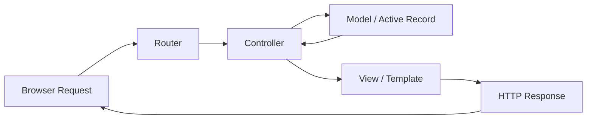

# Ruby on Rails Developer Fundamentals

`[Entry]` `[Mid]` `[Senior]`

A comprehensive guide to building modern web applications with Ruby on Rails 8. This learning path covers the language, the framework, the ecosystem, and the engineering decisions that make Rails a compelling choice in 2026.

---

## Table of Contents

1. [Why Rails in 2026](#1-why-rails-in-2026)
2. [The Rails Mental Model: Convention Over Configuration](#2-the-rails-mental-model-convention-over-configuration)
3. [Ruby: The Language Behind Rails](#3-ruby-the-language-behind-rails)
4. [Rails 8: What's New](#4-rails-8-whats-new)
5. [The Rails Ecosystem](#5-the-rails-ecosystem)
6. [Framework Landscape](#6-framework-landscape)
7. [Decision Framework: When Rails vs Others](#7-decision-framework-when-rails-vs-others)
8. [Common Pitfalls](#8-common-pitfalls)
9. [What's Next](#9-whats-next)

---

## 1. Why Rails in 2026

Ruby on Rails has been continuously shipped for over two decades. Released in 2004 by David Heinemann Hansson (DHH), Rails introduced a philosophy that reshaped how the industry thinks about web development: **developer happiness is a feature, not a luxury**.

### Developer Happiness as a Design Principle

Rails optimizes for the experience of the programmer sitting at the keyboard. This is not sentimentality -- it is an engineering decision with measurable consequences:

- **Faster onboarding.** A new developer joining a Rails team can become productive within days, not weeks. The conventions are shared across every Rails project. A controller in one app works like a controller in every app.
- **Lower cognitive overhead.** Rails makes decisions for you -- directory structure, naming conventions, ORM patterns, testing defaults. You spend your mental budget on business logic, not boilerplate.
- **Sustainable velocity.** Teams report that Rails applications maintain development speed over years, not just the first sprint. The "convention over configuration" philosophy prevents the architectural drift that slows other codebases.

### Rapid Prototyping to Production

Rails famously powered the launch of some of the web's most successful products. The framework was designed to take an idea from concept to working software in hours, not months. What distinguishes Rails from other "fast" frameworks is that the prototype you build on day one is structurally sound enough to become the production system. There is no throwaway prototype phase.

The built-in generators produce production-quality scaffolding:

```bash
rails new myapp
rails generate scaffold Product name:string price:decimal description:text
rails db:migrate
```

Three commands and you have a fully functional CRUD application with a database, routes, views, controllers, model validations, and tests. Every file follows the same conventions that millions of Rails developers worldwide understand.

### Who Runs on Rails

Rails is not a niche framework. It powers businesses at scale:

| Company | Use Case | Scale |
|---------|----------|-------|
| **Shopify** | E-commerce platform | Millions of merchants, billions in GMV |
| **GitHub** | Developer platform | 100M+ developers, the world's largest code host |
| **Basecamp** | Project management | The framework was born here |
| **Airbnb** | Travel marketplace | Used Rails in critical path for a decade |
| **Stripe** | Payment infrastructure | Dashboard and internal tools |
| **Instacart** | Grocery delivery | Core marketplace and fulfillment |
| **Dribbble** | Design community | Full stack Rails application |
| **Cookpad** | Recipe sharing | 100M+ monthly users globally |

These companies did not start with Rails and migrate away. Many continue to invest in their Rails codebases precisely because the framework scales in the dimension that matters most: team productivity.

### The 2026 Reality

Rails 8 ships with everything you need to build and deploy a modern web application:

- **Kamal 2** for production deployment with zero-downtime releases
- **Solid Queue** for background jobs without Redis
- **Hotwire** for SPA-like interactivity without a JavaScript framework
- **Propshaft** for modern asset management
- **Built-in authentication generator** so you stop rolling your own auth

You no longer need a microservices architecture, a separate frontend framework, or a dedicated DevOps team to ship a production-grade web application. Rails 8 brings the full stack back together.

`[Entry]` Start here if you are new to web development. Rails teaches good habits by default.
`[Senior]` Revisit Rails if you have not looked at it since version 5 or 6. The framework has fundamentally changed.

---

## 2. The Rails Mental Model: Convention Over Configuration

Rails is not just a collection of libraries. It is an opinionated architecture built on a single organizing principle: **convention over configuration**. This means the framework makes decisions for you, and those decisions are documented, consistent, and overridable when you genuinely need to diverge.

### Model-View-Controller (MVC)

Rails enforces the MVC pattern at the framework level. Every request flows through a predictable pipeline:



**How to read this diagram:**

1. The browser sends an HTTP request (e.g., `GET /products/42`).
2. The **Router** matches the URL pattern and HTTP method to a controller action (`ProductsController#show`).
3. The **Controller** asks the **Model** for data (`Product.find(42)`).
4. The **Model** (Active Record) queries the database and returns a Ruby object.
5. The **Controller** passes the data to the **View**.
6. The **View** renders HTML (or JSON) and sends it back to the browser.

This is not abstract architecture. This is the literal code path of every Rails request. Understanding this flow is the single most important mental model for working with Rails.

### The Rails Directory Structure

Every Rails application has the same layout. This is not a suggestion -- it is a convention enforced by the framework:

```
app/
  controllers/    # Handle requests, coordinate between models and views
  models/         # Business logic and database interaction (Active Record)
  views/          # Templates rendered as HTTP responses
  helpers/        # View-level utility methods
  jobs/           # Background job classes
  channels/       # WebSocket channels (ActionCable)
  assets/         # Stylesheets, JavaScript, images
config/
  routes.rb       # URL mapping to controllers
  database.yml    # Database connection configuration
db/
  migrate/        # Database migration files (schema evolution)
  schema.rb       # Current database schema snapshot
spec/ or test/    # Automated tests
```

### The Active Record Pattern

Rails implements the Active Record pattern, where each model class maps to a database table and each instance maps to a row:

```ruby
class Product < ApplicationRecord
  # The table name is automatically inferred: "products"
  # Attributes are inferred from the database schema

  validates :name, presence: true
  validates :price, numericality: { greater_than: 0 }

  has_many :order_items
  has_many :orders, through: :order_items

  scope :available, -> { where(active: true) }
  scope :priced_below, ->(max) { where("price < ?", max) }
end
```

```ruby
# Usage -- no SQL required
product = Product.create(name: "Widget", price: 29.99)
product.valid?                    # => true
product.errors.full_messages      # => []

available = Product.available.priced_below(50)
available.each { |p| puts p.name }

# When you need SQL, it is available
expensive = Product.where("price > ?", 100).order(:name)
```

### "The Rails Way"

"The Rails way" means using the framework as intended rather than fighting it. This includes:

- Letting Active Record manage your database interactions instead of writing raw SQL
- Using RESTful resource routing (`resources :products`) instead of hand-crafting routes
- Putting business logic in models, not controllers
- Using built-in form helpers instead of hand-building HTML forms
- Using the built-in test framework (or RSpec) instead of skipping tests

When you follow these conventions, every Rails developer who joins your team immediately understands your codebase. This is the compounding advantage of convention.

`[Entry]` Resist the urge to "customize" Rails until you understand why the conventions exist.
`[Mid]` Know when to override conventions. The framework allows it, but the cost is team familiarity.

---

## 3. Ruby: The Language Behind Rails

Rails is written in Ruby, and understanding Ruby is essential to being effective with Rails. Ruby is not just "the language that Rails uses" -- it is the reason Rails exists.

### Design Philosophy: Principle of Least Surprise

Ruby was designed by Yukihiro "Matz" Matsumoto with a specific goal: **make programmers happy**. The language follows the "principle of least surprise" (POLS), meaning that well-written Ruby code behaves the way you would intuitively expect.

```ruby
# Reading a file -- the code reads like English
File.readlines("data.csv").each do |line|
  puts line.strip
end

# Working with collections
squares = (1..10).map { |n| n ** 2 }
evens   = squares.select { |n| n.even? }
sum     = evens.reduce(0, :+)
```

### Blocks, Procs, and Lambdas

Ruby's blocks are its most distinctive feature. A block is an anonymous function that you can pass to any method:

```ruby
# Block passed to a method
[1, 2, 3, 4, 5].each do |number|
  puts number * 2
end

# Block with select and map
results = users
  .select { |u| u.active? }
  .map    { |u| u.email }
  .uniq
  .sort
```

Blocks enable the iterator and callback patterns that make Rails code so concise. Every `each`, `map`, `select`, and `reject` call uses blocks.

### Modules and Mixins

Ruby uses single inheritance but achieves code reuse through modules (mixins). This is how Rails shares behavior across models, controllers, and other classes:

```ruby
module Searchable
  def search(query)
    where("name ILIKE ?", "%#{query}%")
  end
end

module Taggable
  def tagged_with(tag)
    joins(:tags).where(tags: { name: tag })
  end
end

class Article < ApplicationRecord
  include Searchable
  include Taggable
end

# Now Article has both behaviors
Article.search("rails")
Article.tagged_with("tutorial")
```

Rails uses this pattern extensively. `ActiveRecord::Base`, `ActionController::Base`, and `ActionView::Base` are all assembled from dozens of modules.

### Metaprogramming

Ruby's metaprogramming capabilities are what make Rails' "magic" possible. Methods like `has_many`, `validates`, and `belongs_to` are not hardcoded -- they are dynamically defined:

```ruby
# This is what Rails does internally when you write:
class Product < ApplicationRecord
  has_many :reviews
end

# The has_many method dynamically defines:
# product.reviews         => returns a collection
# product.reviews.build   => returns a new, unsaved review
# product.reviews.create  => builds and saves a review
# product.reviews.count   => counts associated reviews
# ...and more
```

This is not obfuscation. It is abstraction. The `has_many` macro encodes a well-understood pattern (a one-to-many database relationship) into a single declarative line.

### Why Ruby's Expressiveness Enables Rails' Productivity

The relationship between Ruby and Rails is symbiotic:

| Ruby Feature | Rails Benefit |
|-------------|---------------|
| Blocks and iterators | Concise collection manipulation in controllers and views |
| Modules/mixins | Shared behavior across models without inheritance chains |
| Metaprogramming | Declarative DSLs (`has_many`, `validates`, `scope`) |
| Open classes | Extending framework behavior without monkey-patching core gems |
| Operator overloading | Natural arithmetic on `Time`, `Date`, and `BigDecimal` |
| Everything is an object | Consistent APIs (even `nil` has methods) |

`[Entry]` Learn Ruby's blocks and iterators first. They appear in every Rails codebase.
`[Mid]` Understand metaprogramming well enough to read Rails source code.

---

## 4. Rails 8: What's New

Rails 8, released in late 2024 and continuously refined through 2025 and 2026, represents the most significant architectural shift since Rails 3. The theme: **bring the full stack back under one roof**.

### Kamal 2: Production Deployment, Simplified

Kamal (formerly Kamal, originally MRSK) is Rails' answer to deployment complexity. It provides zero-downtime deploys to bare metal or cloud VMs using containerized applications:

```bash
# Install Kamal
gem install kamal

# Deploy to production
kamal deploy
```

```yaml
# config/deploy.yml
service: myapp
image: registry/myapp
servers:
  web:
    - 192.168.1.1
    - 192.168.1.2
  workers:
    - 192.168.1.3
registry:
  server: registry.digitalocean.com
  username:
    - KAMAL_REGISTRY_USERNAME
  password:
    - KAMAL_REGISTRY_PASSWORD
```

Kamal handles building the Docker image, pushing to a registry, pulling on servers, running database migrations, swapping containers, and health checks. No Kubernetes required.

### Solid Queue: Built-in Background Jobs

For over a decade, Rails developers needed Redis and Sidekiq for background jobs. Solid Queue eliminates that dependency for most applications:

```ruby
# app/jobs/send_welcome_email_job.rb
class SendWelcomeEmailJob < ApplicationJob
  queue_as :default

  def perform(user_id)
    user = User.find(user_id)
    UserMailer.welcome(user).deliver_later
  end
end
```

```ruby
# Enqueue the job from anywhere
SendWelcomeEmailJob.perform_later(user.id)

# Schedule for later
SendWelcomeEmailJob.set(wait: 1.hour).perform_later(user.id)
```

Solid Queue uses your existing database as the job backend. For high-throughput applications, you can still use Sidekiq with Redis, but most applications do not need that complexity.

### Propshaft: Modern Asset Management

Propshaft replaces Sprockets as the default asset pipeline. It is faster, simpler, and designed for modern JavaScript:

- No CoffeeScript compilation
- No Sass compilation (use Dart Sass directly or CSS)
- Digests and serves assets efficiently
- Works with import maps and Hotwire

### Hotwire: SPA-Like Without the SPA

Hotwire is Rails' approach to modern frontends. It consists of two components:

**Turbo** handles page navigation and partial updates without writing JavaScript:

```erb
<%-- app/views/products/index.html.erb --%>
<%= turbo_stream_from "products" %>

<div id="products">
  <%= render @products %>
</div>
```

When a product is created, updated, or destroyed on the server, all connected browsers receive the change in real time -- no custom JavaScript, no WebSocket management.

**Stimulus** handles the JavaScript you do need to write:

```html
<!-- app/views/products/_form.html.erb -->
<div data-controller="autosave">
  <input data-action="change->autosave#save"
         data-autosave-target="input"
         type="text" />
</div>
```

```javascript
// app/javascript/controllers/autosave_controller.js
import { Controller } from "@hotwired/stimulus"

export default class extends Controller {
  static targets = ["input"]

  save() {
    clearTimeout(this.timeout)
    this.timeout = setTimeout(() => {
      this.element.requestSubmit()
    }, 1000)
  }
}
```

The result: applications that feel as responsive as single-page apps, but are rendered entirely server-side. Your team writes Ruby, not React.

### Authentication Generator

Rails 8 ships with a built-in authentication generator. No Devise required for standard auth:

```bash
rails generate authentication
```

This produces a complete, secure authentication system with:

- Password hashing (bcrypt)
- Session management
- Password reset
- Account activation
- Remember me functionality

The generated code lives in your application, not in a gem. You can read it, understand it, and modify it.

`[Mid]` Rails 8 is the first version where you can build and deploy a complete application without any third-party gems for auth, jobs, or deployment.
`[Senior]` Evaluate the built-in authentication against Devise. For simple auth, the generator is sufficient. For complex requirements (OAuth, multiple strategies), Devise still has the edge.

---

## 5. The Rails Ecosystem

Rails has a rich gem (library) ecosystem. Knowing when to use a gem and when to use built-in functionality is a critical skill.

### Core Libraries (Built Into Rails)

| Library | Purpose | When to Use |
|---------|---------|-------------|
| **Active Record** | ORM, database abstraction | Always -- it is the default |
| **Action Controller** | Request handling | Always |
| **Action View** | Template rendering | Always |
| **Action Mailer** | Email sending | Transactional emails |
| **Active Job** | Background job interface | Any async work |
| **Action Cable** | WebSocket support | Real-time features |
| **Active Storage** | File uploads | Image, document, and file handling |
| **Action Text** | Rich text editing | WYSIWYG content |
| **Active Support** | Utility extensions | Always -- extends Ruby core classes |

### Essential Gems

| Gem | Purpose | When to Use | Built-in Alternative? |
|-----|---------|-------------|-----------------------|
| **Devise** | Authentication | Complex auth: OAuth, 2FA, multiple strategies | Rails 8 auth generator (for simple cases) |
| **Sidekiq** | Background jobs | High-throughput job processing (10k+ jobs/min) | Solid Queue (for most applications) |
| **RSpec + FactoryBot** | Testing | All test suites | Minitest (built-in, also excellent) |
| **Pundit** | Authorization | Role-based access control | Action Policy or hand-rolled |
| **AASM** | State machines | Complex status workflows | Simple state columns with enums |
| **Kaminari** | Pagination | Any paginated list | Pagy (faster alternative) |
| **Rails ERD** | Documentation | Visualizing model relationships | Manual diagramming |

### When to Use Gems vs Built-in

**Use a gem when:**

- The problem is solved definitively by the gem (authentication, pagination)
- The gem is actively maintained with recent commits and a healthy issue tracker
- Rolling your own would take weeks and the gem does it in a line of configuration
- The gem solves a cross-cutting concern (logging, monitoring, error tracking)

**Use built-in functionality when:**

- Rails already provides the feature (authentication in Rails 8, background jobs with Solid Queue)
- The gem adds complexity that outweighs its benefit for your use case
- Your requirements are simple enough that the gem's abstractions get in the way
- You need full control over the implementation

**Write your own when:**

- The problem is core to your business logic
- No gem adequately solves the problem
- The available gems are unmaintained or poorly designed

`[Entry]` Start with built-in Rails features. Add gems only when you hit a limitation.
`[Senior]` Audit your Gemfile annually. Remove gems that are no longer necessary as Rails adds built-in equivalents.

---

## 6. Framework Landscape

Rails does not exist in a vacuum. Understanding how it compares to alternatives helps you make informed technology choices.

### Rails vs The Field

| Dimension | Rails (Ruby) | Laravel (PHP) | Django (Python) | Spring Boot (Java) |
|-----------|-------------|---------------|-----------------|---------------------|
| **Philosophy** | Convention over configuration | Expressive, developer experience | Batteries included, explicit | Enterprise, type-safe |
| **Language** | Ruby | PHP | Python | Java / Kotlin |
| **ORM** | Active Record | Eloquent | Django ORM | JPA / Hibernate |
| **Frontend** | Hotwire (server-rendered) | Blade + Livewire | Templates + HTMX | Thymeleaf or SPA |
| **Background Jobs** | Solid Queue / Sidekiq | Queue / Horizon | Celery | Spring Batch / Quartz |
| **Deployment** | Kamal 2 | Laravel Forge / Vapor | Manual / Docker | Kubernetes / JARs |
| **Testing** | RSpec / Minitest | PHPUnit | pytest | JUnit |
| **Typing** | Dynamic | Dynamic | Dynamic | Static |
| **Startup Speed** | Fast (cold start ~1s) | Fast | Moderate | Slow (JVM warm-up) |
| **Hiring Pool** | Moderate | Large | Very large | Very large |
| **Best For** | Startups, SaaS, content platforms | Startups, agencies, e-commerce | Data-heavy apps, APIs, ML-adjacent | Enterprise, large teams |

### Rails vs Laravel

Rails and Laravel share the most similar philosophy. Taylor Otwell (Laravel's creator) has openly cited Rails as an inspiration. The key difference is language ecosystem:

- **Choose Rails** if your team prefers Ruby's expressiveness, or you value the mature Rails plugin ecosystem.
- **Choose Laravel** if your team has PHP experience, or you want Laravel Forge/Vapor for managed deployment, or you need to integrate with existing PHP systems.

Laravel's ecosystem (Nova, Horizon, Telescope) is polished, but it is also more commercial. Rails' ecosystem is more open-source and community-driven.

### Rails vs Django

Both are "batteries included" frameworks with strong conventions:

- **Choose Rails** if you value developer happiness as a primary concern, or you want Hotwire for interactive frontends without JavaScript.
- **Choose Django** if your application is data-heavy or ML-adjacent (Python's data ecosystem is unmatched), or you need the Django admin panel for rapid internal tools.

Django's admin panel is a genuine differentiator for internal tools and CRUD-heavy applications. Rails has ActiveAdmin and Administrate, but they are not as seamless.

### Rails vs Spring Boot

These frameworks target different problems:

- **Choose Rails** for rapid development, startup speed, and smaller teams. Rails excels when you need to move fast with a small team.
- **Choose Spring Boot** for enterprise environments with large teams, strict type safety requirements, or when you need JVM ecosystem libraries (Kafka, Hadoop, enterprise messaging).

Spring Boot's compile-time type checking catches errors that Ruby would only surface at runtime. For teams where runtime errors in production are unacceptable, this is a meaningful tradeoff.

`[Mid]` You should be able to articulate why your team chose Rails over alternatives in a single sentence.
`[Senior]` Evaluate frameworks based on team composition and product timeline, not technical preferences.

---

## 7. Decision Framework: When Rails vs Others

Technology choices should be driven by constraints, not preferences. Use this framework to make objective decisions.

### Decision Criteria

| Criterion | Favors Rails | Favors Alternatives |
|-----------|-------------|---------------------|
| **Time to market** | Need to ship in weeks, not months | Have months to invest in architecture |
| **Team size** | Small team (1-8 developers) | Large team (20+ developers) |
| **Team expertise** | Ruby experience or willing to learn | Deep expertise in Python, PHP, or Java |
| **Product type** | SaaS, marketplace, content platform, e-commerce | ML/AI pipeline, data engineering, mobile API only |
| **Frontend needs** | Server-rendered with Hotwire | Complex client-side state (consider API mode + SPA) |
| **Scale trajectory** | Moderate scale (up to 10k RPS) | Extreme scale (100k+ RPS from day one) |
| **Existing systems** | Greenfield or Rails-friendly stack | Must integrate with enterprise Java/.NET systems |
| **Hiring** | Can hire Ruby developers | Must hire from a larger pool (Python/Java) |
| **Long-term maintenance** | Monolith with clear conventions | Microservices with independent deployability |

### Decision Table

```
IF time_to_market < 3 months
   AND team_size <= 8
   AND product_type IN (SaaS, marketplace, content, e-commerce)
   THEN Rails (confidence: HIGH)

IF product_type = ML_pipeline OR data_engineering
   THEN Django (confidence: HIGH)

IF team_size > 20
   AND type_safety = required
   THEN Spring Boot (confidence: MEDIUM)

IF existing_stack = PHP
   AND team_prefers = PHP
   THEN Laravel (confidence: HIGH)

IF frontend_complexity = extreme
   AND real_time_collaboration = required
   THEN Rails API + React/Vue (confidence: MEDIUM)
```

### Monolith vs Microservices

Rails 8 strongly favors the monolith approach, and the evidence supports this:

- Basecamp runs a monolith serving millions of users.
- Shopify runs a "modular monolith" at massive scale.
- GitHub ran a Rails monolith for its first decade (and much of it remains monolithic).

The microservices pattern introduces operational complexity (network calls, distributed transactions, deployment coordination) that is rarely justified until you have a specific, measurable scaling problem.

**Start with a monolith. Extract services when you have data that proves a specific bottleneck.** This is not compromise -- it is good engineering.

`[Senior]` Never choose an architecture based on where you hope to be in three years. Choose based on where you are today and the cost of refactoring later.

---

## 8. Common Pitfalls

Even experienced Rails developers fall into these traps. Knowing them by name helps you avoid them.

### N+1 Queries

The most common and most impactful performance problem in Rails applications. It occurs when you load a collection of records and then access an association on each one:

```ruby
# BAD: N+1 query -- one query per order
orders = Order.all
orders.each do |order|
  puts order.user.name  # Separate query for EACH order
end

# GOOD: Eager load associations
orders = Order.includes(:user).all
orders.each do |order|
  puts order.user.name  # No additional queries
end
```

**Detection:** Use the `bullet` gem in development. It logs N+1 queries and suggests `includes` calls.

```ruby
# Gemfile
gem "bullet", group: :development
```

### Callback Hell in Models

Rails callbacks (`before_save`, `after_create`, etc.) are powerful but dangerous when overused. They create hidden dependencies and make testing difficult:

```ruby
# BAD: Hidden side effects
class User < ApplicationRecord
  after_create :send_welcome_email
  after_create :create_default_workspace
  after_create :subscribe_to_newsletter
  after_create :notify_slack
end

# Now User.create! triggers four side effects
# that are invisible at the call site.
# Testing becomes painful.
# Changing behavior requires understanding the callback chain.
```

```ruby
# GOOD: Explicit service objects
class CreateUser
  def initialize(params)
    @params = params
  end

  def call
    user = User.create!(@params)
    SendWelcomeEmailJob.perform_later(user.id)
    CreateDefaultWorkspace.call(user)
    SubscribeToNewsletter.call(user)
    NotifySlack.user_signed_up(user)
    user
  end
end
```

**Rule of thumb:** If a callback triggers side effects outside the database (email, API calls, jobs), move it to a service object. Only use callbacks for data integrity concerns (normalizing attributes, computing derived fields).

### Overusing Gems

Every gem you add is code you do not control. The costs are real:

- **Upgrade friction.** Every gem must be compatible with every other gem and with Rails itself.
- **Security surface area.** Every gem is a potential attack vector.
- **Abstraction leakage.** When a gem does not do exactly what you need, you fight its abstractions instead of writing your own code.
- **Vendor lock-in.** Deep integration with a gem makes it expensive to remove later.

**Audit your Gemfile regularly.** Ask: "Do we still need this? Could Rails do this natively now? Is this gem maintained?"

### Slow Test Suites

Rails test suites naturally grow slower as the application grows. The common causes and fixes:

| Cause | Fix |
|-------|-----|
| Loading Rails for every test | Use `rails test` parallelization, or Spring |
| Database-heavy tests | Use transactional fixtures (default), avoid `DatabaseCleaner` |
| Too many system tests | Reserve system tests for critical flows; use integration tests for the rest |
| Factory bloat | Use `build_stubbed` instead of `create` when you do not need database records |
| Shared setup in `before` blocks | Use `let` and `let!` in RSpec, or test-context methods |

```ruby
# BAD: Creating unnecessary database records
let(:user) { create(:user) }           # Hits the database
let(:post) { create(:post, user: user) } # Hits the database again

# GOOD: Stub when you do not need persistence
let(:user) { build_stubbed(:user) }
let(:post) { build_stubbed(:post, user: user) }
```

### Monolith Becoming Unmaintainable

A monolith becomes unmaintainable not because of its size, but because of poor internal boundaries. The fix is not microservices -- it is modular architecture:

```ruby
# Use Rails engines or namespace-based modules
# to enforce boundaries within the monolith

# app/models/billing/invoice.rb
module Billing
  class Invoice < ApplicationRecord
    # Billing logic stays here
  end
end

# app/models/catalog/product.rb
module Catalog
  class Product < ApplicationRecord
    # Catalog logic stays here
  end
end
```

Enforce module boundaries with `rubocop` and code review. A `Billing` model should not directly reference a `Catalog` model. Communicate through well-defined interfaces.

`[Mid]` Set up the `bullet` gem in every project. N+1 queries are not a question of "if" but "when."
`[Senior]` Establish service object patterns early. Callbacks are fine for data integrity but toxic for side effects.

---

## 9. What's Next

This guide covers the fundamentals. The next steps depend on your level:

### Entry Level

1. **Build something.** Complete a small Rails project (blog, task manager, or product catalog) from scratch. Use the generators. Follow the conventions.
2. **Learn Ruby deeply.** Work through a Ruby-focused resource. Understanding blocks, modules, and iterators is non-negotiable.
3. **Write tests.** From day one. Use RSpec or Minitest. Test-driven development in Rails is natural because the framework was designed for it.
4. **Deploy.** Use Kamal 2 to deploy your project to a real server. The deployment process will teach you more about Rails than any tutorial.

### Mid Level

1. **Read the Rails source code.** Start with `ActiveRecord::Base`. Understanding how Rails works internally makes you dramatically more effective.
2. **Master database queries.** Learn SQL alongside Active Record. Understand indexes, query plans, and when to use raw SQL vs. ORM methods.
3. **Build API-only applications.** Learn `ActionController::API` and how to structure JSON APIs for mobile or SPA frontends.
4. **Performance profiling.** Learn to use `rack-mini-profiler`, `bullet`, and New Relic / Datadog to identify and fix performance bottlenecks.

### Senior Level

1. **Architect multi-application systems.** Design systems where a Rails monolith communicates with extracted services when the data demands it.
2. **Contribute to Rails.** The framework is open source. Understanding the contribution process makes you a better engineer and a more valuable team member.
3. **Mentor.** Teach Rails to junior developers. Explaining the framework forces you to understand it at a deeper level.
4. **Evaluate emerging patterns.** Stay current with Rails releases, new gems, and evolving best practices. The framework moves fast.

---

## License

This learning path is part of the TP-Coder Innovation Hub educational content.

`[Entry]` `[Mid]` `[Senior]`
